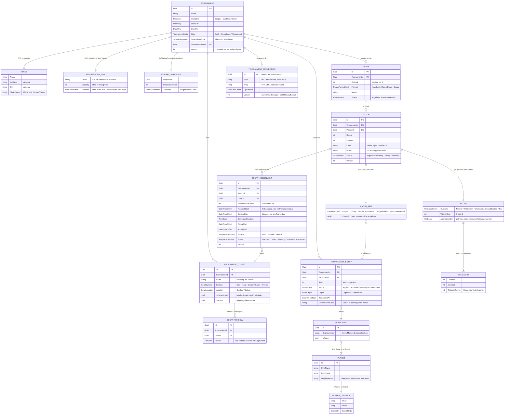
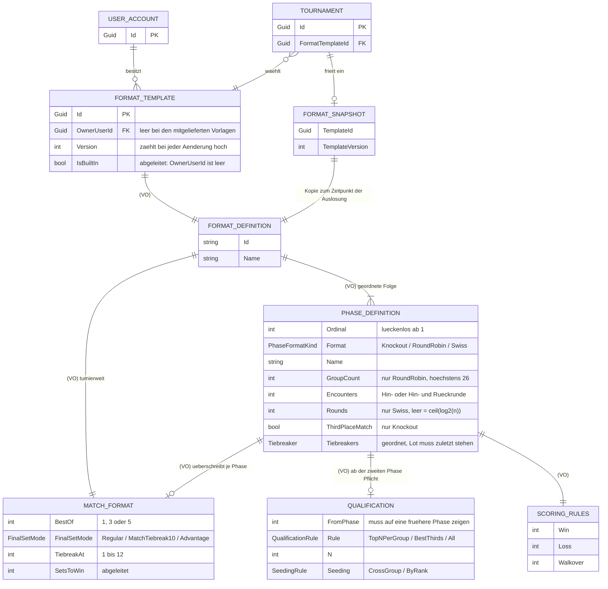
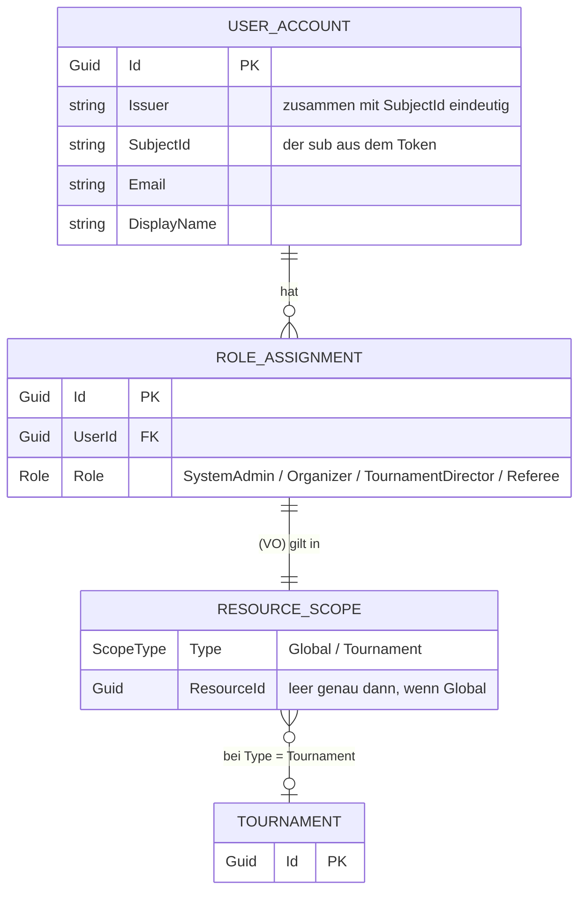
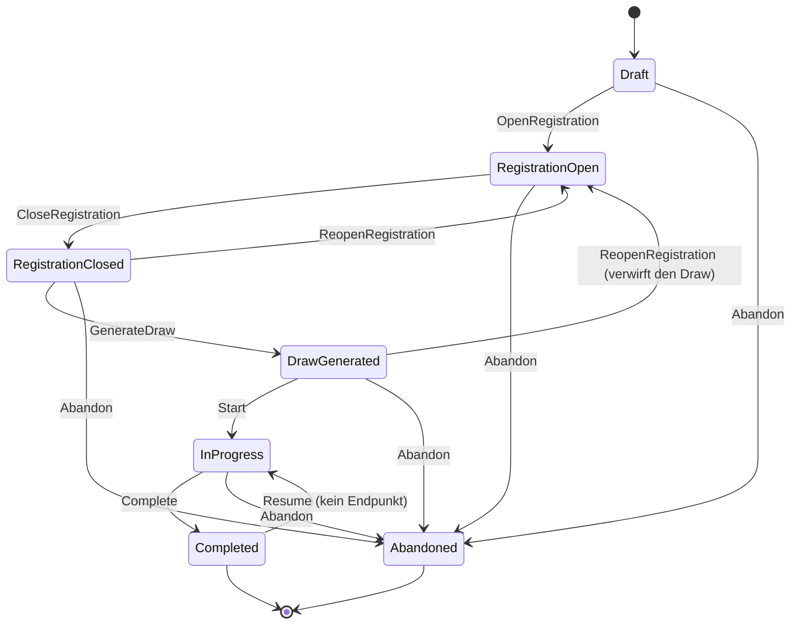
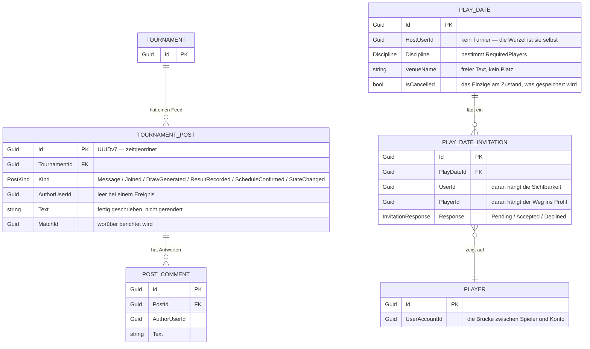

# Das Domänenmodell

Stand: nach M15 (Profil, Feed, Kontakte, Verabredungen).

Diese Datei zeichnet nach, was in `src/TennisTurnier.Domain` steht. Sie ersetzt
keine ADR — das *Warum* steht dort, hier steht das *Was*. Wenn beide sich
widersprechen, gilt der Code.

> `domaenenmodell.html` daneben ist ein älterer Export dieser Datei aus VS Code
> und wird nicht mitgepflegt. Maßgeblich ist das Markdown.

## Lesehilfe

- **Aggregatwurzeln** sind fett benannt: `Tournament`, `Phase`, `Participant`,
  `Player`, `CourtAssignment`, `FormatTemplate`, `UserAccount`,
  `TournamentProjection`, `TournamentPost`, `PlayDate`.
- **(VO)** kennzeichnet ein Wertobjekt. Es hat keine eigene Identität und wird
  mit seinem Besitzer geschrieben — in der Datenbank meist als Spalten derselben
  Zeile oder als JSON.
- Beziehungen **über eine Aggregatgrenze hinweg** sind reine Id-Referenzen. Es
  gibt keine Objektnavigation von `Match` zu `TournamentEntry`; es gibt eine
  `Guid`.
- `Phase`, `Match`, `CourtWindow` und `CourtAssignment` tragen alle eine eigene
  `TournamentId`, obwohl sie über ihren Vater erreichbar wären. Das ist Absicht:
  der Query-Filter aus ADR-0004 arbeitet auf der Menge der sichtbaren Turniere
  und bliebe sonst zweistufig.

---

## 1. Der Turnierkern

### Was an diesem Bild wichtig ist

**`MatchSide` trägt Herkunft und Auflösung getrennt.** `Origin` ist die Regel
(„Sieger aus Match 7"), `EntryId` ihr aktuelles Ergebnis. Würde die Auflösung die
Herkunft überschreiben, ließe sich ein Ergebnis nicht mehr zurücknehmen, ohne den
falschen Namen stehen zu lassen. `ParticipantRef` ist deshalb ein Summentyp und
das Fundament des ganzen Baums (ADR-0001) — „Zweiter der Gruppe B" und „Sieger
aus Match 7" sind derselbe Mechanismus.

**Ein Match kann mehrere Platzzuweisungen haben.** Unterbrochen und auf einem
anderen Platz fortgesetzt: erst beide Zuweisungen zusammen erzählen, was an
diesem Tag passiert ist (ADR-0002).

**Der abgebrochene Satz steht getrennt von den gespielten.** Läge er in derselben
Liste, zählte ein Stand von 2:1 als gewonnener Satz, und die Tabelle wiese einen
Satz aus, der nie zu Ende gespielt wurde.

**Teilnahme in drei Schichten.** `Player` ist die Person und existiert
turnierübergreifend, `Participant` die antretende Einheit (einer oder ein Paar),
`TournamentEntry` die Meldung mit Status und Setzposition. `Participant` von
Anfang an einzuziehen ist der Grund, warum das Doppel kein Sonderfall in
Setzliste, Spielplan und Ergebniseingabe ist.

---

## 2. Formate

Ein Turniermodus ist eine Phasenfolge, kein Code (ADR-0001). „Gruppenphase mit
anschließendem K.o." ist eine Komposition aus zwei `PhaseDefinition`.

Der `FormatSnapshot` ist der Grund, warum eine geänderte Vorlage ein laufendes
Turnier nicht berührt. `TemplateVersion` hält fest, aus welchem Stand er stammt.

Die Formate selbst — `KnockoutFormat`, `RoundRobinFormat`, `SwissFormat` —
stehen hinter `IPhaseFormat` und sind zustandslos: sie bekommen einen
`PhaseState` und rechnen. Deshalb lässt sich jede Paarungslogik ohne Aggregat und
ohne Datenbank testen.

---

## 3. Benutzer und Rollen

Die Rechte-Matrix steht an einer einzigen Stelle (`Security/Permissions.cs`):

| Rolle | Scope | Rechte |
|---|---|---|
| `SystemAdmin` | Global | alle |
| `Organizer` | Global | `CreateTournament` |
| `TournamentDirector` | Tournament | `ManageTournament`, `EnterResults`, `ViewInternals`, `ViewMembers`, `WriteInFeed` |
| `Referee` | Tournament | `EnterResults`, `ViewMembers`, `WriteInFeed` |
| `Member` | Tournament | `ViewMembers`, `WriteInFeed` |

`Member` ist die Rolle, die ein Turnier zur Gruppe macht (ADR-0012). Ihre zwei
Rechte betreffen beide die Gruppe: sie sieht, wer dazugehört, und sie darf im
Feed schreiben (ADR-0014). Alles Weitere, was ein Mitglied sieht — Draw,
Spielplan, Ergebnisse —, kommt nicht aus dieser Matrix, sondern aus dem
Query-Filter, der an der Rollenzuweisung hängt.

`Organizer` ist global und trotzdem harmlos: sein einziges Recht beantwortet
„wer darf herein", nicht „wer sieht was". Wer ein Turnier anlegt, wird dessen
`TournamentDirector`. `RoleAssignment` weist im Konstruktor jeden Scope ab, der
nicht zur Rolle passt — eine globale Rolle lässt sich am Turnier nicht vergeben.

---

## 4. Der Lebenszyklus eines Turniers

Kein ER, aber ohne ihn ist die Hälfte der Regeln oben unverständlich.

Ab `DrawGenerated` gilt `IsFrozen`: Teilnehmerfeld und Format sind eingefroren,
eine Nachmeldung verlangt den ausdrücklichen Rückschritt. Der Weg aus
`RegistrationClosed` zurück kostet nichts und muss es geben — sonst wäre ein zu
früh geschlossenes Turnier mit weniger als zwei Meldungen eine Sackgasse.

`Resume` hat bewusst keinen Endpunkt. Er folgt aus der Rücknahme eines
Ergebnisses, so wie `Complete` aus dem letzten Ergebnis folgt.

`SchedulingMode` (`Planning` / `MatchDay`) läuft **orthogonal** zu diesem
Automaten: der Wechsel zum Turniertag setzt eine Auslosung voraus, ist aber kein
Zustandsübergang des Turniers. Im Planungsmodus ist eine Uhrzeit eine Schätzung,
am Turniertag eine Zusage (ADR-0002).

---

## 5. Das soziale Umfeld

Drei Bausteine stehen neben dem Turnierkern. Zwei davon gehören einem Turnier
und erben dessen Sichtbarkeit; der dritte gehört keinem und trägt seine eigene.

### Was an diesem Bild wichtig ist

**`TournamentPost.Text` ist ein Text und kein Verweis.** Auch bei einem
Ereignis: „Anna Müller schlägt Lena Berger 6:4 6:2" wird beim Eintragen des
Ergebnisses geschrieben und danach nicht mehr angefasst. Ein Eintrag, der zur
Anzeigezeit aus dem Match gerendert würde, wäre normalisiert und immer aktuell —
und genau deshalb falsch, denn ein Feed ist ein Protokoll (ADR-0014). Eine
Korrektur schreibt eine zweite Zeile.

**Die Id ist eine UUIDv7.** Der Feed sortiert nach `CreatedAt`, und zwei
Einträge können denselben Zeitstempel tragen — ein Beitritt und die Meldung dazu
entstehen im selben Aufruf. Als Stichentscheid taugt eine zufällige Guid nicht;
eine v7 trägt ihre Entstehungszeit vorn und ordnet damit richtig, auch als Text,
in dem SQLite sie ablegt.

**`PlayDate` hat kein Turnier — und das ist die Entscheidung.** ADR-0009 sagt,
was die Wurzel *eines Turniers* ist, nicht, dass es nur eine Sorte Wurzel gäbe.
Sie kennt keine Phase, keinen Draw und kein Ergebnis. Deshalb greift auf ihr
auch der Query-Filter aus ADR-0004 nicht: sie trägt ihren eigenen, und er lautet
„der Gastgeber und die Eingeladenen, sonst niemand" (ADR-0015).

**Am Zustand einer Verabredung wird genau eines gespeichert: `IsCancelled`.**
`RequiredPlayers` folgt aus der Disziplin (Einzel zwei, sonst vier), `Committed`
aus den Zusagen samt Gastgeber, `IsConfirmed` aus beidem und „vorbei" aus der
Uhr. Drei Zustände zu pflegen hieße, drei Gelegenheiten zu haben, sie falsch zu
setzen.

**`Player.Profile` (VO)** trägt die zwei Angaben, die niemand berechnen kann —
einen Text über sich und den Heimatverein. Sie liegen bewusst neben
`PlayerContact` und nicht darin: Kontakt ist das, was nie nach außen darf,
Profil das, was ausdrücklich dafür geschrieben wurde (ADR-0013).

**Die Spielhistorie ist kein Aggregat.** Bilanz, Turniere und die letzten
Matches eines Spielers werden bei jedem Aufruf über den sichtbaren Ausschnitt
gerechnet — es gibt dafür keine Tabelle und keine Projektion. Der
Kontaktgraph fällt aus derselben Rechnung ab.

---

## Wo man weiterliest

| Frage | Datei |
|---|---|
| Warum Phasen und `ParticipantRef` | `docs/adr/0001-turnierformate-als-phasen.md` |
| Warum Warteschlange statt Zeitraster | `docs/adr/0002-scheduling-planungsraster-und-queue.md` |
| Warum die öffentliche Sicht ein eigener Lesestand ist | `docs/adr/0003-getrenntes-read-modell.md` |
| Warum Rollen einen Scope tragen | `docs/adr/0004-club-scoped-autorisierung.md` (Superseded) |
| Warum der Spieler keine Vereinsbindung hat | `docs/adr/0008-spielerstammdaten.md` (Superseded) |
| Warum der Zähler fachlich und nicht `rowversion` ist | `docs/adr/0006-sqlite-als-startdatenbank.md` |
| Warum der Verein weg ist | `docs/adr/0009-turnier-als-wurzelaggregat.md` |
| Wie der Meldeweg ohne Konto funktioniert | `docs/adr/0010-oeffentliche-selbstmeldung.md` (Superseded) |
| Warum ein Turnier eine Gruppe ist | `docs/adr/0012-mitgliedschaft-statt-selbstmeldung.md` |
| Warum ein Profil für zwei Betrachter verschieden aussieht | `docs/adr/0013-spielerprofil-und-verbindungen.md` |
| Warum ein Feed-Eintrag seinen Text mitbringt | `docs/adr/0014-turnierfeed.md` |
| Warum eine Verabredung kein Turnier mit einem Match ist | `docs/adr/0015-verabredungen.md` |
